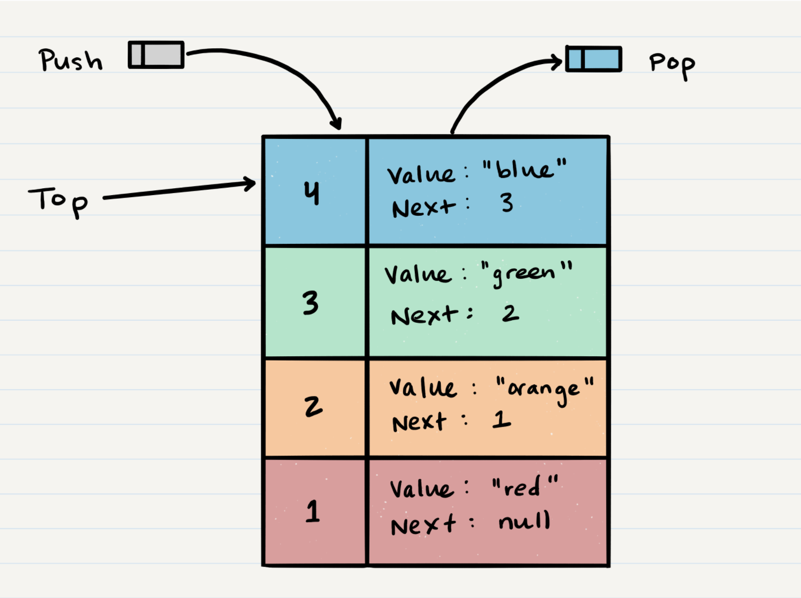
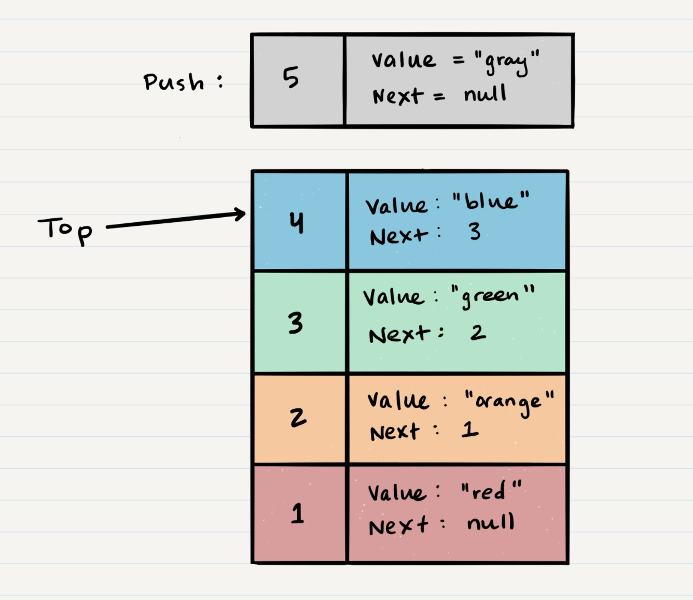
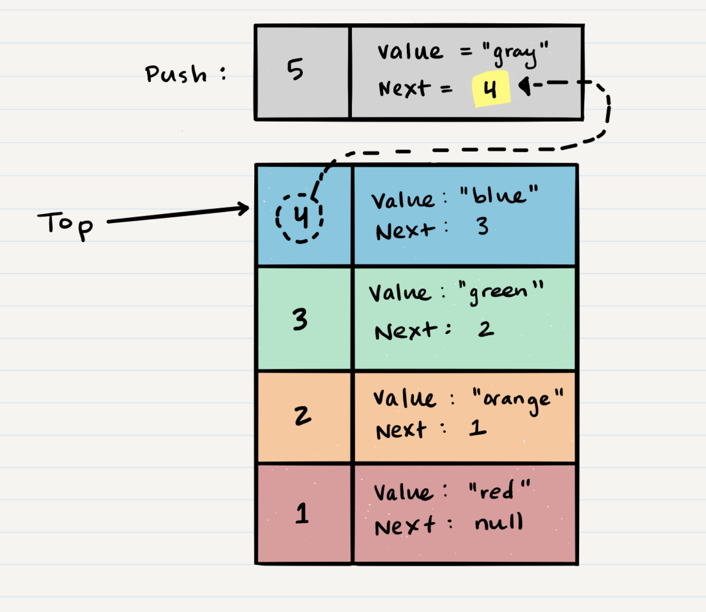
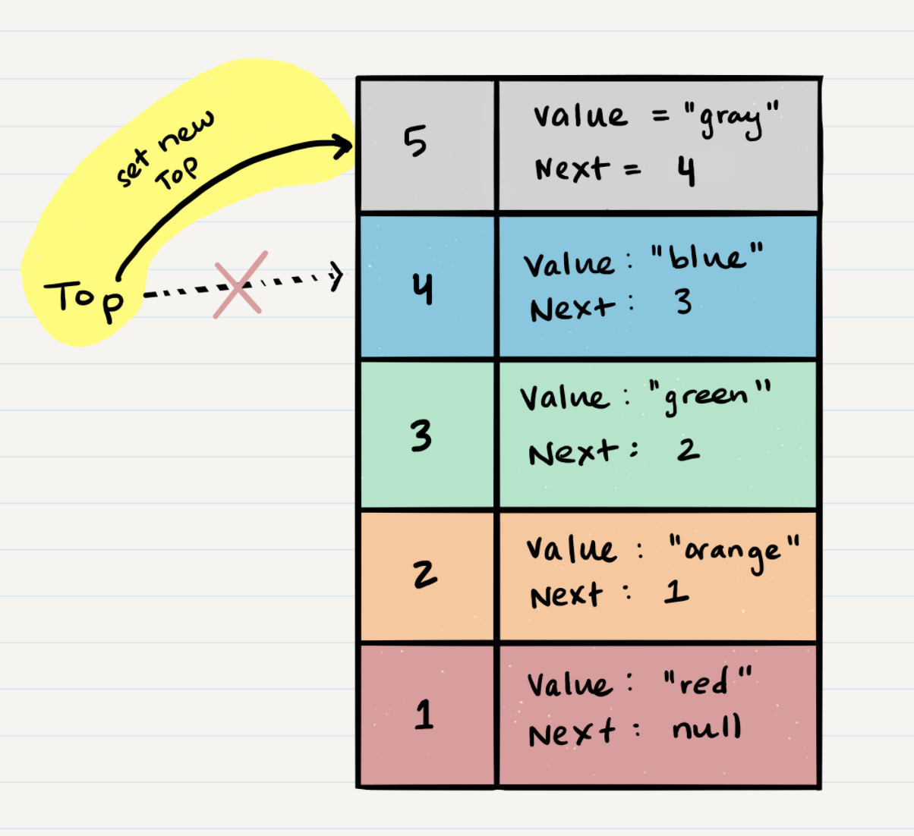
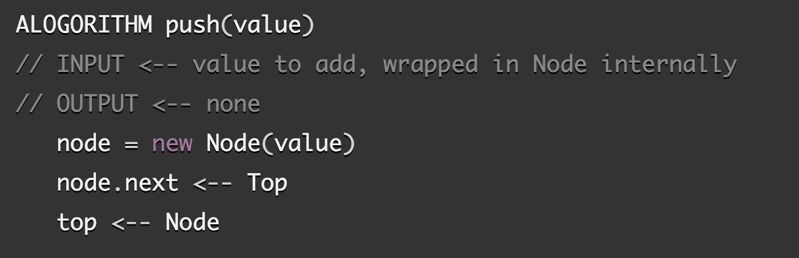

# Stacks and Queues

[source](https://codefellows.github.io/common_curriculum/data_structures_and_algorithms/Code_401/class-10/resources/stacks_and_queues.html)

What is a stack?

A stack is a data structure that consists of Nodes. Each Node references the next Node in the stack, but does not reference its previous.

Common terminology for a stack is

  1. Push - Nodes or items that are put into the stack are pushed
  2. Pop - Nodes or items that are removed from the stack are popped. When you attempt to pop an empty stack an exception will be raised.
  3. Top - This is the top of the stack.
  4. Peek - When you peek you will view the value of the top Node in the stack. When you attempt to peek an empty stack an exception will be raised.
  5. IsEmpty - returns true when stack is empty otherwise returns false.

- FILO (First In Last Out)
This means that the first item added in the stack will be the last item popped out of the stack.

- LIFO (Last In First Out)
This means that the last item added to the stack will be the first item popped out of the stack.

- Stack Visualization
The topmost item is denoted as the top. When you push something to the stack, it becomes the new top. When you pop something from the stack, you pop the current top and set the next top as top.next.

- Push O(1)

Pushing a Node onto a stack will always be an O(1) operation. This is because it takes the same amount of time no matter how many Nodes (n) you have in the stack.

When adding a Node, you push it into the stack by assigning it as the new top, with its next property equal to the original top.

1. First, you should have the Node that you want to add. Here is an example of a Node that we want to add to the stack.

2. Next, you need to assign the next property of Node 5 to reference the same Node that top is referencing: Node 4

3. Technically at this point, your new Node is added to your stack, but there is no indication that it is the first Node in the stack. To make this happen, you have to re-assign our reference top to the newly added Node, Node 5.

4. Congratulations! You completed a successful push of Node 5 onto the stack.

- Pop O(1)
Popping a Node off a stack is the action of removing a Node from the top. When conducting a pop, the top Node will be re-assigned to the Node that lives below and the top Node is returned to the user.

Typically, you would check isEmpty before conducting a pop. This will ensure that an exception is not raised. Alternately, you can wrap the call in a try/catch block.

- Peek O(1)
When conducting a peek, you will only be inspecting the top Node of the stack.

Typically, you would check isEmpty before conducting a peek. This will ensure that an exception is not raised. Alternately, you can wrap the call in a try/catch block.

We do not re-assign the next property when we peek because we want to keep the reference to the next Node in the stack. This will allow the top to stay the top until we decide to pop.

- What is a Queue
Common terminology for a queue is

- Enqueue - Nodes or items that are added to the queue.
- Dequeue - Nodes or items that are removed from the queue. If called when the queue is empty an exception will be raised.
- Front - This is the front/first Node of the queue.
- Rear - This is the rear/last Node of the queue.
- Peek - When you peek you will view the value of the front Node in the queue. If called when the queue is empty an exception will be raised.
- IsEmpty - returns true when queue is empty otherwise returns false.

Queues follow these concepts:

- FIFO
First In First Out

This means that the first item in the queue will be the first item out of the queue.

- LILO
Last In Last Out
