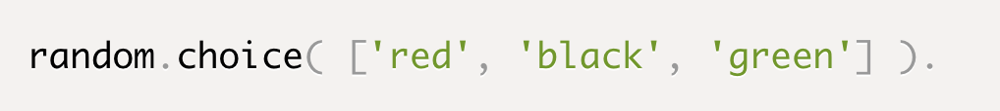

# Class 06 Reading: Game of Greed 1

## How to use the Random Module in Python

## What is the Random Module?

The random module is a built-in module to generate the pseudo-random variables. It can be used perform some action randomly such as to get a random number, selecting a random elements from a list, shuffle elements randomly, etc. [souce](https://www.tutorialsteacher.com/python/random-module)

## When to use it?

We want the computer to pick a random number in a given range Pick a random element from a list, pick a random card from a deck, flip a coin etc. When making your password database more secure or powering a random page feature of your website. [source](https://www.pythonforbeginners.com/random/how-to-use-the-random-module-in-python)

## Random functions

Randint
  
- If we wanted a random integer, we can use the randint function Randint accepts two parameters: a lowest and a highest number. Generate integers between 1,5. The first value should be less than the second.

Random

- If you want a larger number, you can multiply it.
  - A random number between 0 and 100

Choice

- Generate a random value from the sequence sequence.

Shuffle

- The shuffle function, shuffles the elements in list in place, so they are in a random order.

## What is Risk Analysis in Software Testing and how to perform it?

The probability of any unwanted incident is defined as Risk. In Software Testing, risk analysis is the process of identifying the risks in applications or software that you built and prioritizing them to test. After that, the process of assigning the level of risk is done. The categorization of the risks takes place, hence, the impact of the risk is calculated. [source](https://www.edureka.co/blog/risk-analysis-in-software-testing/)

## Why use Risk Analysis?

In any software, using risk analysis at the beginning of a project highlights the potential problem areas. After knowing about the risk areas, it helps the developers and managers to mitigate the risks. When a test plan has been created, risks involved in testing the product are to be taken into consideration along with the possibility of the damage they may cause to your software along with solutions. [source](https://www.edureka.co/blog/risk-analysis-in-software-testing/)

Now, you might think what could be the possible risks that you could encounter? Well here is a list:

- Use of new hardware
- Use of new technology
- Use of new automation tool
- The sequence of code
- Availability of test resources for the application

Now, you must know there are certain risks that are unavoidable.

1. The time that you allocated for testing

2. A defect leakage due to the complexity or size of the application

3. Urgency from the clients to deliver the project

4. Incomplete requirements

In such cases, you have to tackle the situation with care. Following points can be taken care of:

- Conduct Risk Assessment review meeting

- Use maximum resources to work on high-risk areas

- Create a Risk Assessment database for future use

- Identify and notice the risk magnitude indicators: high, medium, low.

What are these risk magnitude indicators?

High: means the effect of the risk would be very high and non-tolerable. The company might face loss.

Medium: it is tolerable but not desirable. The company may suffer financially but there is a limited risk.

Low: it is tolerable. There lies little or no external exposure or no financial loss.

Sources:
[What is Risk Analysis in Software Testing and how to perform it?](https://www.edureka.co/blog/risk-analysis-in-software-testing/)

[How to use the Random Module in Python
](https://www.pythonforbeginners.com/random/how-to-use-the-random-module-in-python)
